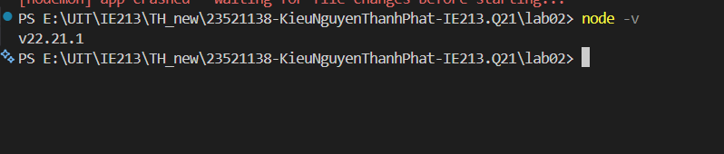

## lab02 - Thiết lập môi trường (Bài 1)

### 1.1 Cài đặt Node.js
- **Kiểm tra**: chạy lệnh `node -v` (v 20.18.0)


### 1.2 Cài đặt công cụ soạn thảo mã nguồn
- **Sử dụng**: VS Code.

### 1.3 Khởi tạo cây thư mục dự án
- **Thư mục mã nguồn**: `lab02/` (backend).

### 1.4 Khởi tạo dự án với `npm init`
- **Kết quả**: đã có file `package.json` trong `lab02/`.

### 1.5 Cài đặt dependencies
Đã cài đặt các package (runtime dependencies):
- `mongodb`
- `express`
- `cors`
- `dotenv`

### 1.6 Cài đặt `nodemon`
- **Dev dependency**: `nodemon`
- **Tài liệu**: `https://www.npmjs.com/package/nodemon`
- **Scripts** trong `lab02/package.json`:
  - `npm run dev`: chạy `nodemon backend/index.js` (tự khởi động lại khi code thay đổi)
  - `npm start`: chạy `node backend/index.js`

### Cách chạy nhanh
```bash
cd lab02
npm run dev
```

## Bài 2: Khởi tạo backend Movie Reviews

### Cấu trúc thư mục (backend)
```
lab02/
  backend/
    api/
      movies.controller.js
      movies.route.js
    dao/
      moviesDAO.js
    .env
    index.js
    server.js
```

### 2.1 Tạo tệp tin `server.js` để khởi tạo máy chủ web
- **Tạo file**: `backend/server.js`
- **Middleware**: `cors`, `express.json()`
- **Routing**:
  - mount `/api/v1/movies`
  - xử lý lỗi **404** (not found)

### 2.2 Tạo tệp tin `.env`
- **Tạo file**: `backend/.env`
- **Biến môi trường**:
  - `MOVIEREVIEWS_DB_URI`: URI kết nối MongoDB Atlas
  - `MOVIEREVIEWS_NS`: ví dụ `sample_mflix`
  - `PORT`: ví dụ `3000`
- **Ví dụ** (xem `lab02/.env.example`):
  - `MOVIEREVIEWS_DB_URI=mongodb+srv://<database_user>:<database_password>@.../`
  - `MOVIEREVIEWS_NS=sample_mflix`
  - `PORT=3000`

### 2.3 Tạo tệp tin `index.js` để kết nối DB và chạy máy chủ
- **Tạo file**: `backend/index.js`
- **Chức năng**:
  - đọc biến môi trường bằng `dotenv`
  - kết nối MongoDB bằng `mongodb.MongoClient`
  - gọi `MoviesDAO.injectDB(client)` sau khi kết nối DB
  - chạy server `app.listen(...)`

### 2.4 Tạo route cho Movies
- **Tạo file**: `backend/api/movies.route.js`
- **Endpoint**: `GET /api/v1/movies/`

### 2.5 Thiết lập DAO (Data Access Object)
- **Tạo folder**: `backend/dao`
- **Tạo file**: `backend/dao/moviesDAO.js`
- **Class**: `MoviesDAO`
  - `injectDB(conn)`: tham chiếu tới collection `movies` trong DB `process.env.MOVIEREVIEWS_NS`
  - `getMovies({ filters, page, moviesPerPage })`: trả `{ moviesList, totalNumMovies }` (mặc định `page=0`, `moviesPerPage=20`)

### 2.6 Thiết lập Controller
- **Tạo file**: `backend/api/movies.controller.js`
- **Class**: `MoviesController`
  - `apiGetMovies(req, res, next)`: nhận query (`page`, `moviesPerPage`, `rated/title`), gọi `MoviesDAO.getMovies(...)` và trả JSON

### 2.7 Đưa Controller vào định tuyến
- **Cập nhật** `backend/api/movies.route.js` để `GET /` gọi `MoviesController.apiGetMovies`

### Cách chạy & test nhanh
```bash
cd lab02
npm install
npm run dev
```

- Test API:
  - `GET http://localhost:3000/api/v1/movies/`
  - `GET http://localhost:3000/api/v1/movies/?moviesPerPage=1&page=0`