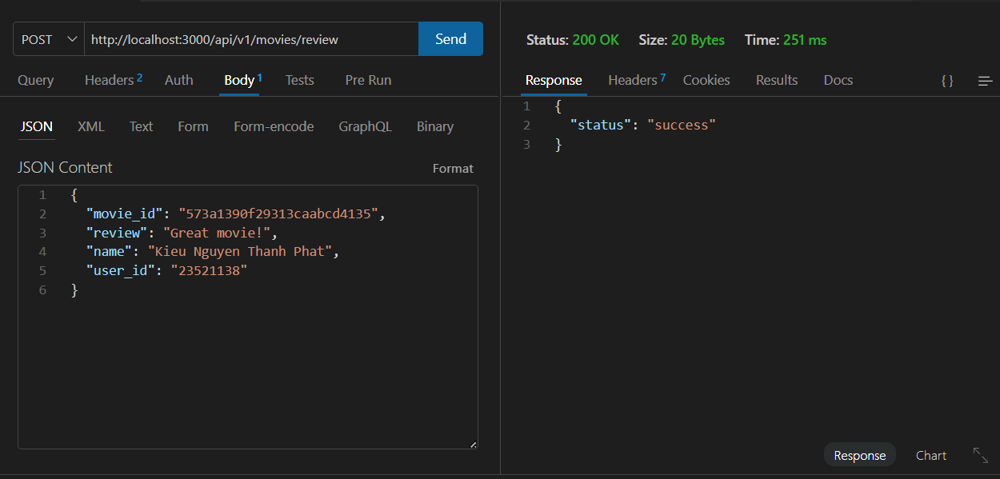
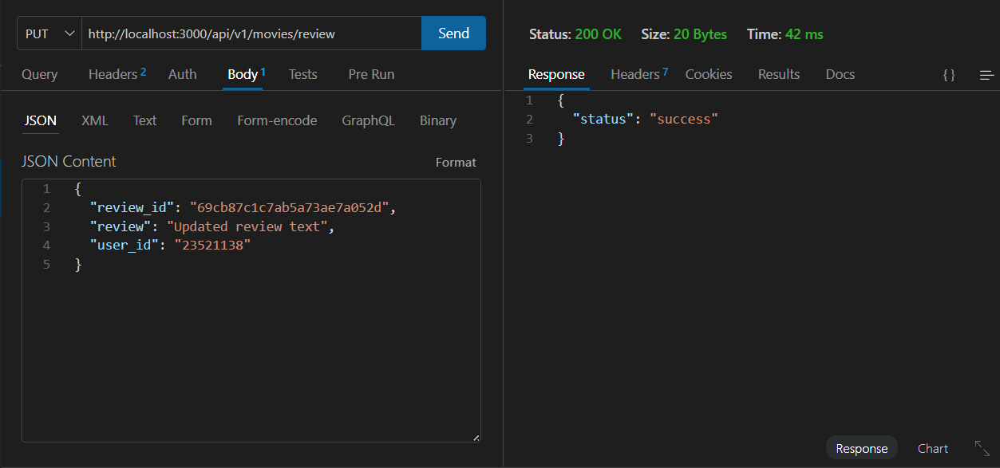
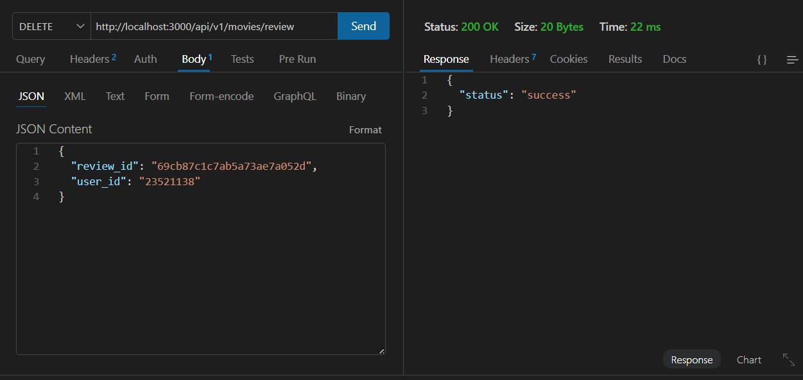

## Lab 3: Định tuyến + Controller + DAO cho Review

### Mục tiêu

Trong Lab 3, hệ thống được bổ sung các API để tạo/sửa/xóa `review` trong MongoDB thông qua lớp:
`Route (movies.route.js)` -> `ReviewsController (reviews.controller.js)` -> `ReviewsDAO (reviewsDAO.js)`.

### Cấu trúc thư mục (lab3)

```
lab3/
  backend/
    api/
      movies.route.js
      movies.controller.js
      reviews.controller.js
    dao/
      moviesDAO.js
      reviewsDAO.js
    index.js
    server.js
  .env
```

### Môi trường

- Kiểm tra Node.js (tham chiếu): `./img/node-version.png`
- File cấu hình: `Lab03/.env`
     - `MOVIEREVIEWS_DB_URI`: URI kết nối MongoDB Atlas
     - `MOVIEREVIEWS_NS`: database (ví dụ `sample_mflix`)
     - `PORT`: port chạy server (ví dụ `3000`)

### Cách chạy chương trình

```bash
cd Lab03
npm install
npm run dev
```

Server chạy tại:

- `http://localhost:3000`

### Các endpoint Review

Đường dẫn cuối: `/review`

1. Tạo review (POST)

- `POST http://localhost:3000/api/v1/movies/review`
- Body JSON:

```json
{
        "movie_id": "573a1390f29313caabcd42e8",
        "review": "Great movie!",
        "name": "Nguyen Van A",
        "user_id": "5b4b8a3d7a4f2c1a9c2b3d4e"
}
```

- Kết quả: trả `{"status":"success"}` nếu insert thành công

2. Sửa review (PUT)

- `PUT http://localhost:3000/api/v1/movies/review`
- Body JSON:

```json
{
        "review_id": "REVIEW_OBJECT_ID",
        "review": "Updated review text",
        "user_id": "USER_OBJECT_ID"
}
```

- Lưu ý: update chỉ thành công nếu `user_id` đúng với user đã tạo review (lọc theo `{ user_id, _id }`)

3. Xóa review (DELETE)

- `DELETE http://localhost:3000/api/v1/movies/review`
- Body JSON:

```json
{
        "review_id": "REVIEW_OBJECT_ID",
        "user_id": "USER_OBJECT_ID"
}
```

- Kết quả: trả `{"status":"success"}` nếu delete thành công

### Hình ảnh minh hoạ (Postman)

#### Create Review


#### Update Review


#### Delete Review


### Những nội dung đã hoàn thành

- 2/2 tuyến cho review đã được triển khai trong `backend/api/movies.route.js`:
     - `POST /review` -> `ReviewsController.apiPostReview`
     - `PUT /review` -> `ReviewsController.apiUpdateReview`
     - `DELETE /review` -> `ReviewsController.apiDeleteReview`
- Controller:
     - `lab3/backend/api/reviews.controller.js` đã có `apiPostReview`, `apiUpdateReview`, `apiDeleteReview`
- DAO:
     - `lab3/backend/dao/reviewsDAO.js` đã có `injectDB`, `addReview`, `updateReview`, `deleteReview`
     - Convert ID bằng `new mongodb.ObjectId(...)`

### Những nội dung chưa hoàn thành

- Không có.